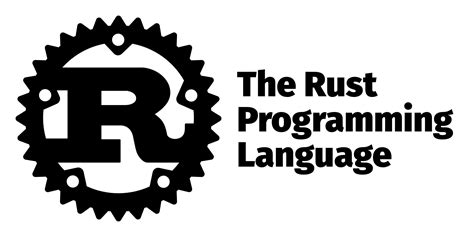

# Rust Repository 

The Rust programming language is a systems programming language that focuses on safety, security, and concurrency. It is also designed to be fast, memory-efficient, and portable.

Repo of example programs I have used to learn rust

[Rust Docs](https://doc.rust-lang.org/book/ch01-00-getting-started.html)